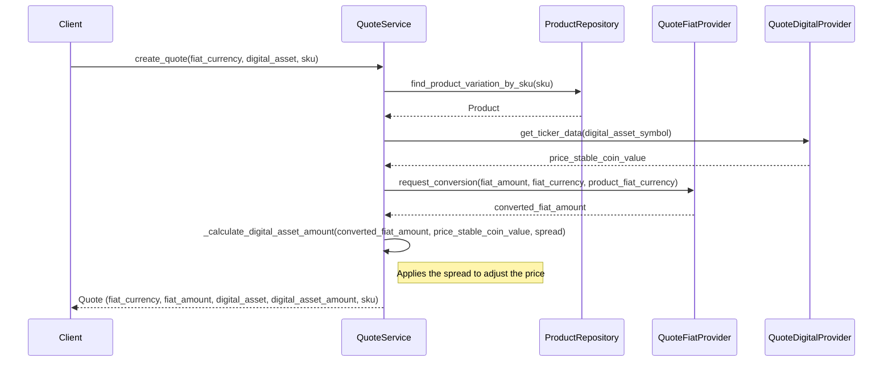

# Product Catalog endpoint API

## 1. Overview

## 2. Objectives

- Allow users to convert fiat currencies into supported digital assets.
- Provide real-time quotes based on exchange rates from selected providers.
- Enable configurable spreads and flexible rate sources.
- Integrate with external providers for fiat and cryptocurrency rates.

## 3. Architecture

The API involves interaction with various components for currency conversion and quote calculation.

## API Specification

### Endpoint

 
[openapi.json](./openapi.json) 

