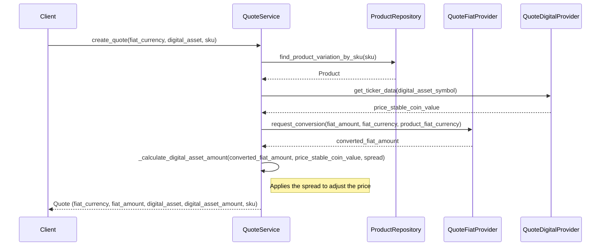

# Fiat to Digital Asset Conversion API

## 1. Overview

This document outlines the design and implementation of the Fiat-to-Digital Asset Conversion API.  
The API facilitates converting fiat currencies to digital assets and returns a quoted amount based on   
current exchange rates. It supports configurable spreads and multiple external providers for FX and crypto pricing.

## 2. Objectives

- Allow users to convert fiat currencies into supported digital assets.
- Provide real-time quotes based on exchange rates from selected providers.
- Enable configurable spreads and flexible rate sources.
- Integrate with external providers for fiat and cryptocurrency rates.

## 3. Architecture

The API involves interaction with various components for currency conversion and quote calculation.




## API Specification

### Endpoint

- **URL**: `/api/v1/quotes/`
- **Method**: `POST`

### Request Body

```json
{
  "fiat_currency": "string",
  "digital_asset": "string",
  "sku": "string"
}
```

* **fiat_currency**: ISO 4217 code for the fiat currency (e.g., "USD").
* **digital_asset**: Digital asset for conversion (e.g., "USDC").
* **sku**: Product identifier.

Response Body
```json
{
  "fiat_currency": "string",
  "fiat_amount": "string",
  "digital_asset": "string",
  "digital_asset_amount": "string",
  "sku": "string"
}
```
* **fiat_currency**: The fiat currency used.
* **fiat_amount**: The amount in fiat currency.
* **digital_asset**: The digital asset converted to.
* **digital_asset_amount**: The quoted amount in the digital asset.
* **sku**: Product identifier.
