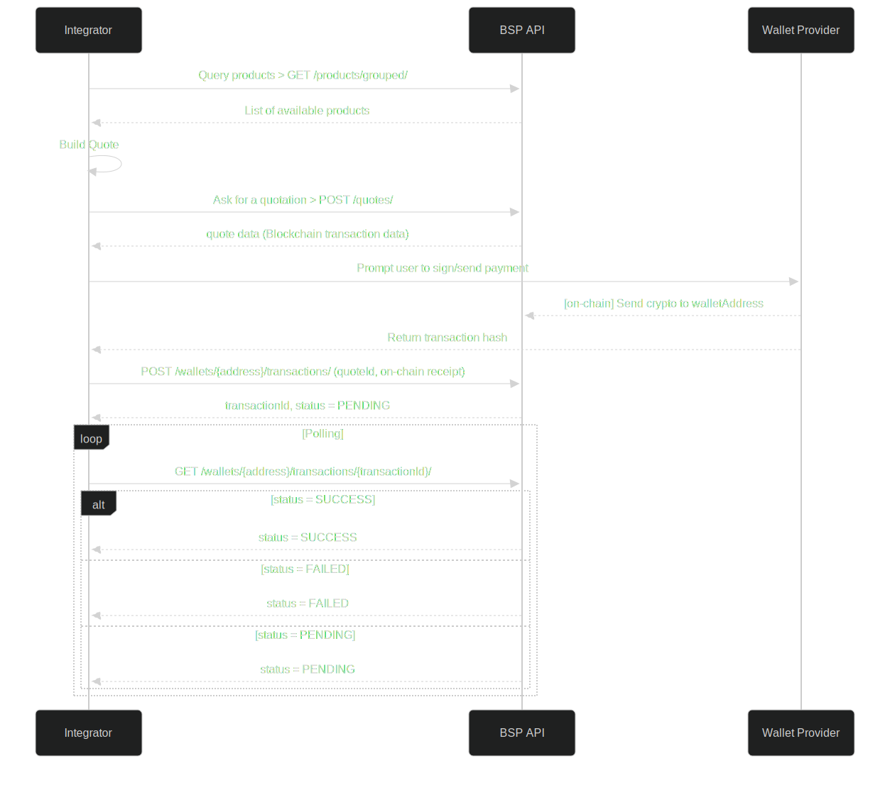

# 🧾 Bando Spending Protocol Integration Guide

> This guide walks technical users (integrators) through the process of spending via the **Bando Spending Protocol (BSP)**. The flow involves retrieving products, creating a quote, paying with a wallet, registering the transaction, and tracking its status.

📘 [OpenAPI Specification](https://api.bando.cool/api/v1/openapi.json)

---

## General diagram

<!---

sequenceDiagram
    participant I as Integrator
    participant BSP as BSP API
    participant Wallet as Wallet Provider

    I->>BSP: Query products > GET /products/grouped/
    BSP- ->>I: List of available products

    I->>I: Build Quote
    I->>BSP: Ask for a quotation > POST /quotes/
    BSP- ->>I: quote data (Blockchain transaction data)

    I->>Wallet: Prompt user to sign/send payment
    Wallet- ->>BSP: [on-chain] Send crypto to walletAddress
    Wallet- ->>I: Return transaction hash

    I->>BSP: POST /wallets/{address}/transactions/ (quoteId, on-chain receipt)
    BSP- ->>I: transactionId, status = PENDING

    loop Polling
        I->>BSP: GET /wallets/{address}/transactions/{transactionId}/
        alt status = SUCCESS
            BSP- ->>I: status = SUCCESS
        else status = FAILED
            BSP- ->>I: status = FAILED
        else status = PENDING
            BSP- ->>I: status = PENDING
        end
    end
-->

## 1. 🔎 Discover Available Products

**Endpoint:**
`GET /products/grouped/`

This endpoint returns all spendable products grouped by category.


[Broken link](broken-reference)


---

## 2. 💬 Create a Quote

**Endpoint:**
`POST /quotes/`


[Broken link](broken-reference)


---

## 3. 💸 Perform Wallet Payment

This step occurs **outside BSP** and involves using the quote response (e.g. `walletAddress`, `amount`) to send crypto via wallet (MetaMask, WalletConnect, CLI, etc.).

You must:

* Initiate the transfer
* Capture the **payment transaction hash**

💡 Use base units (e.g. wei) and ensure the amount and destination address match the quote.

---

## 4. 📝 Register Spending Transaction

**Endpoint:**
`POST /wallets/{address}/transactions/`

Use the sender’s wallet address in the path. Submit both `quoteId` and the `paymentTxHash` from the previous step.


[Broken link](broken-reference)


---

## 5. 🔍 Track Transaction Status

**Endpoint:**
`GET /wallets/{address}/transactions/{transactionId}/`

Use this to check the current status (`PENDING`, `SUCCESS`, or `FAILED`) of the transaction you registered.


[Broken link](broken-reference)


---

## ✅ Full Flow Summary

| Step | Action                    | Method | Endpoint                                           |
| ---- | ------------------------- | ------ | -------------------------------------------------- |
| 1    | Get products              | `GET`  | `/products/grouped/`                               |
| 2    | Create quote              | `POST` | `/quotes/`                                         |
| 3    | Wallet payment (external) | –      | –                                                  |
| 4    | Register transaction      | `POST` | `/wallets/{address}/transactions/`                 |
| 5    | Track transaction status  | `GET`  | `/wallets/{address}/transactions/{transactionId}/` |

