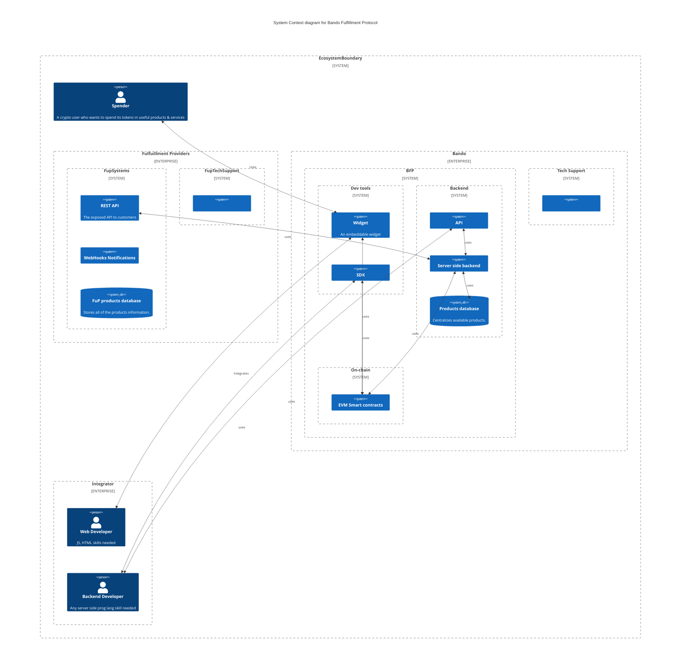

# Protocol Architecture

## C4 context

```mermaid
    C4Context
      title System Context diagram for Bando Fulfillment Protocol
      System_Boundary(ecosystem, "EcosystemBoundary") {
        Person(spender, "Spender", "A crypto user who wants to spend its tokens in useful products & services")

        Enterprise_Boundary(b1, "Fulfuillment Providers") {
          System_Boundary(fs, "FupSystems") {
            System(FUPAPI, "REST API", "The exposed API to customers")
            System(WebHooksAPI, "WebHooks Notifications", "")
            SystemDb(SystemE, "FuP products database", "Stores all of the products information.")
          }
          System_Boundary(fts, "FupTechSupport") {
            System(FUPSupport, "", "")
            
          }
        }

        Enterprise_Boundary(bando, "Bando") {
          System_Boundary(bandosystems, "BFP") {
            System_Boundary(devtools, "Dev tools") {
              System(Widget, "Widget", "An embeddable widget")
              System(SDK, "SDK", "")
            }

            System_Boundary(sss, "Backend") {
                System(API, "API", "")
                System(backend, "Server side backend", "")
                
                SystemDb(db, "Products database", "Centralizes available products.")

                BiRel(API, backend, "uses")
                BiRel(backend, db, "uses")
            }

            System_Boundary(onchain, "On-chain") {
                System(smartcontracts, "EVM Smart contracts", "")
            }
          }
          System_Boundary(ftse, "Tech Support") {
            System(FUPSupporte, "", "") 
          }
        }

        Enterprise_Boundary(integrator, "Integrator") {
          Person(integrator_web_developer, "Web Developer", "JS, HTML skills needed")
          Person(integrator_backend_developer, "Backend Developer", "Any server side prog lang skill needed")
          
        }
      }

      BiRel(Widget, smartcontracts, "uses")
      BiRel(SDK, smartcontracts, "uses")
      BiRel(backend, smartcontracts, "uses")

      BiRel(spender, Widget, "Uses")
      BiRel(integrator_web_developer, Widget, "Integrates")
      BiRel(integrator_backend_developer, API, "uses")
      BiRel(integrator_backend_developer, SDK, "uses")

      BiRel(backend, FUPAPI, "uses")

```