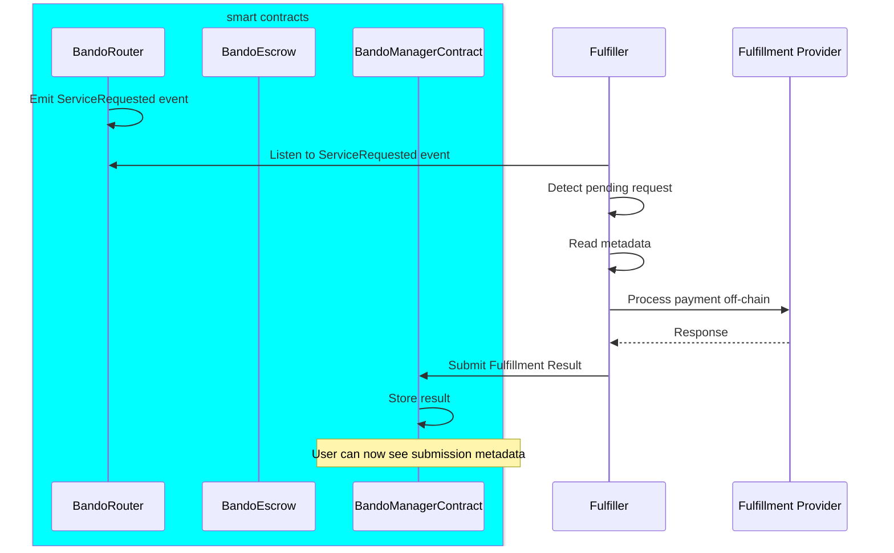

# Fulfilling a request

Right after the funds have been transferred to the Bando Escrow contract, the request SHOULD now be considered as fulfillable. This means that a fulfiller can detect this pending service request and perform the necessary payment or order. 

1. To do this, the fulfiller can listen to the ServiceRequested event emitted by the Router after transfer and then process the request.
2. Once detected, the fulfiller reads the metadata, and processes the payment off chain to the relevant FuP
3. Once the FuP has responded, the fulfiller MUST submit a Fulfillment Result to the on-chain protocol. This is done submitting a result via the Bando Manager contract.
4. Once the result submission is stored in the contract. The user can now see the submission metadata.

