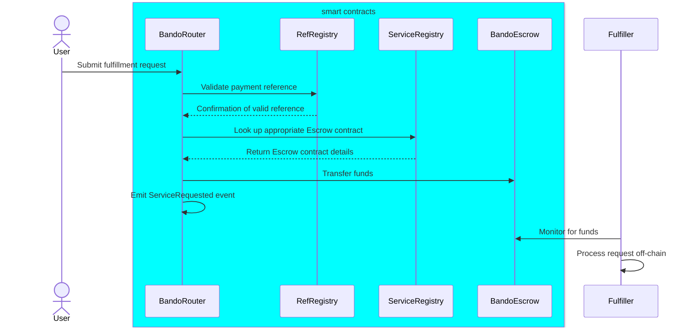

# Order Request

Right after a user has selected a product or service to buy, the wallet will send a request to the Bando Fulfillment Protocol to create a new order.
Before submitting a request, the according ref MUST have been verified by the Bando backend system and ingested to the RefRegistry smart contract. Once that is in place, a user SHALL interact with the BandoRouter contract to submit a fulfillment request.

The Bando Router Contract is a smart contract responsible for routing the user's service request to the appropriate Bando Escrow contract using a managed Service Registry contract. The process follows these steps:

1. The BandoRouter first checks the RefRegistry to validate the payment reference
2. If the reference is valid, the router looks up the appropriate Escrow contract using the Service Registry
3. Once the router verifies the reference and identifies the correct Escrow, it transfers the funds to the escrow
4. The router contract then emits a ServiceRequested event with the necessary data
5. Once the funds for the request are in the corresponding Escrow contract, the fulfiller is notified and becomes responsible for processing the product or service request and fulfilling the user's request off-chain

