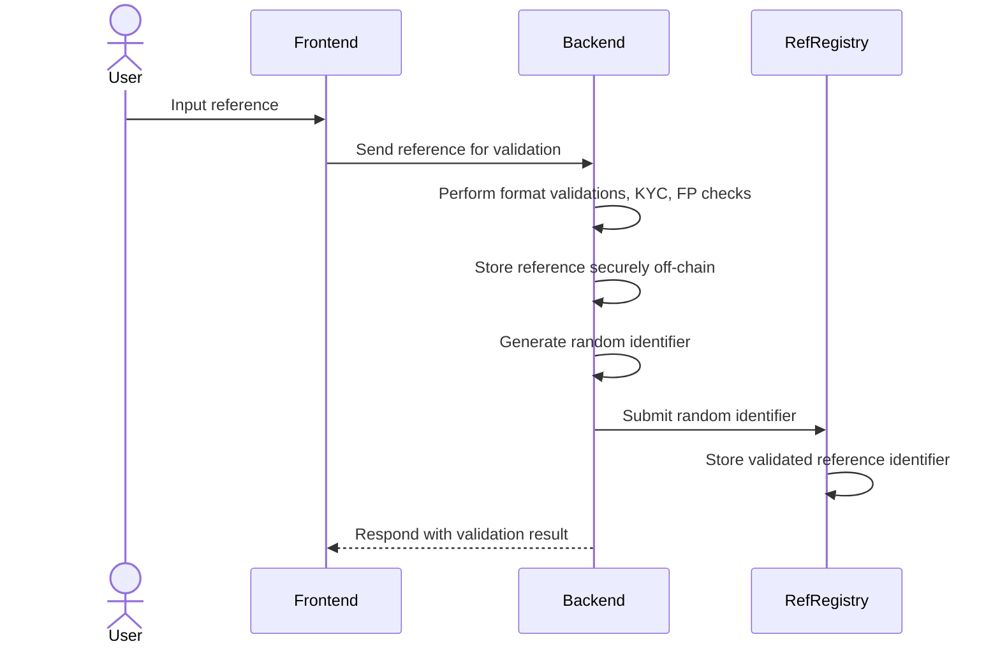

# Payment Reference Validation

Thus process refers to ingesting, verifying and storing a payment reference added by a user as part of a fulfillment request.

## What is a payment reference?
A ref refers to any string of characters the SHOULD be used to redeem or identify a potential fulfillment request for a specific service or product. eg. a cellphone, email, username, service number, ID card, etc.

## How will the protocol protect the user’s data?
The payment references are sensitive in nature because they can potentially identify an individual. So we MUST deem them as PII. To protect users’ data, the protocol uses a combination of off-chain with on-chain mechanisms to route the payment correctly.

1. The user inputs the ref
2. The Ref Validation API ingests the payment reference into the backend
3. The system will perform format validations as well as KYC and/or FP validations
4. Once verified, the reference is stored securely off-chain, and a random identifier is generated
5. The random identifier is then submitted to the `**Reference Registry**` smart contract on-chain, which holds every validated reference known to the protocol.

### Accepting/Rejecting a payment reference