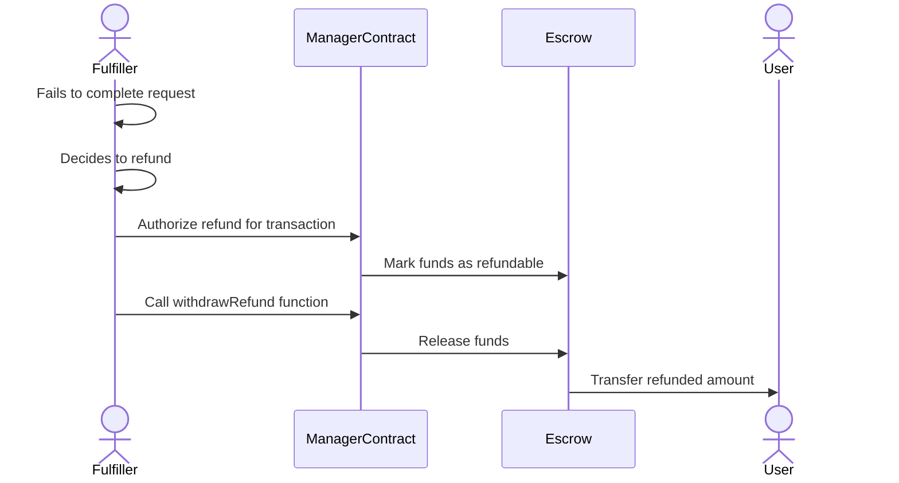

# Order Refunds

## Submitting a Fulfillment Result

Once the BandoRouter emits a `ServiceRequested` event, the corresponding fulfiller must listen for this event or transaction to fulfill the order.

After the order is fulfilled for the user off-chain, the fulfiller must interact with the BFP's manager contract to call `registerFulfillmentResult`. This call submits the result to an on-chain registry, changes the status of the request, and releases the funds in escrow to the beneficiary (the fulfiller's configured address).

## Authorizing a Refund

As a conscious decision, we made the refund process authorizable by the fulfiller. This choice was made to avoid possible re-entrancies and to prevent potential DoS attacks and theft of funds. The process follows these steps:

1. The fulfiller fails to complete a request and decides to refund
2. The fulfiller (the only one with permissions) interacts with the Manager Contract to authorize a refund for the transaction
3. The funds in escrow are now marked as refundable to the user's address
4. The fulfiller calls the `withdrawRefund` function, and the funds are released to the target address
