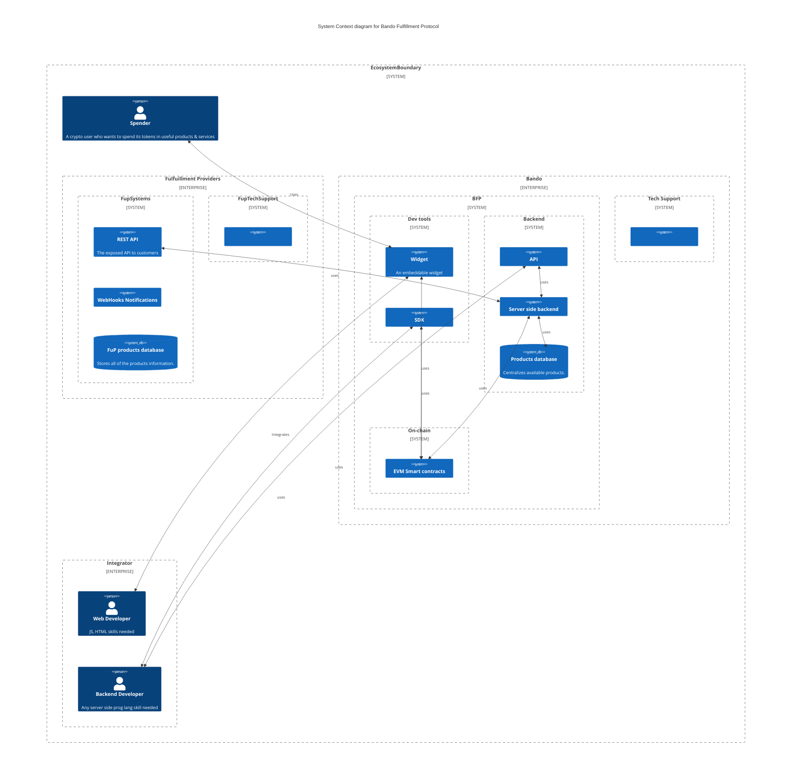
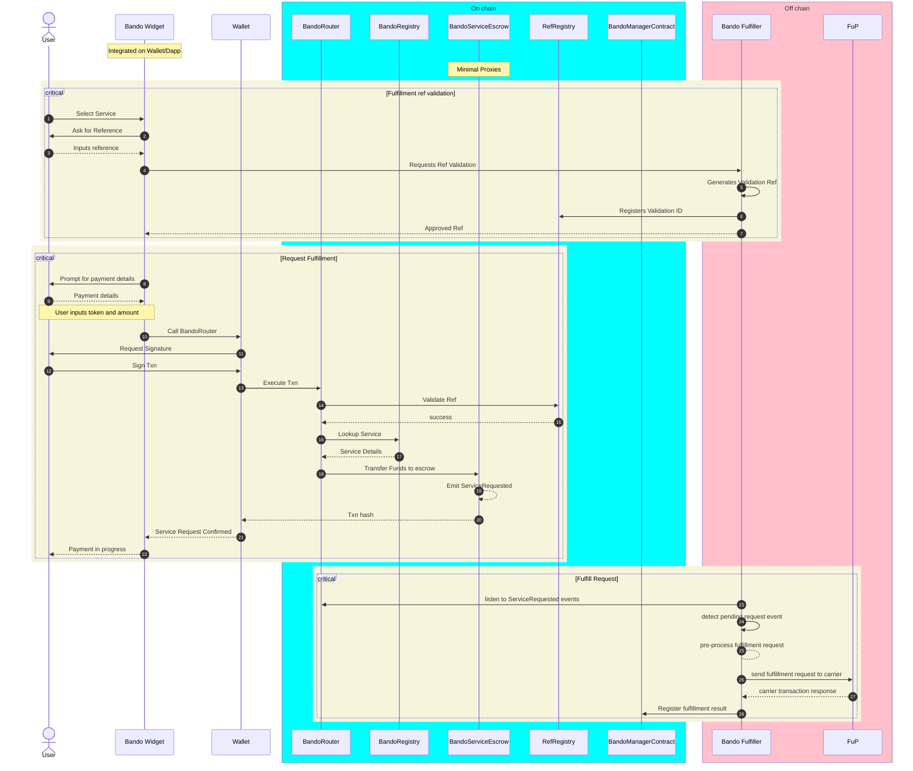

# Protocol Architecture

## Bando System Context 

## Bando Fulfillment Process

<table data-view="cards">
  <thead>
    <tr>
      <th></th><th></th><th data-hidden data-card-cover data-type="files"></th><th data-hidden></th><th data-hidden data-card-target data-type="content-ref"></th>
    </tr>
  </thead>
  <tbody>
    <tr>
      <td><strong>Payment Refs</strong></td><td>How the BFP validate payments</td><td></td><td></td><td><a href="payment-reference-validation.md">payment-reference-validation.md</a></td>
    </tr>
    <tr>
      <td><strong>Request a payment</strong></td><td>How the BFP routes payments</td><td></td><td></td><td><a href="order-request.md">order-request</a></td>
    </tr>
    <tr>
      <td><strong>Completing orders</strong></td><td>How the BFP make the requests whole</td><td></td><td></td><td><a href="order-fulfillment.md">order-fulfillment</a></td>
    </tr>
    <tr>
      <td><strong>Emitting refunds</strong></td><td>How the BFP authorizes and sends refunds</td><td></td><td></td><td><a href="refunds.md">refunds</a></td>
    </tr>
  </tbody>
</table>