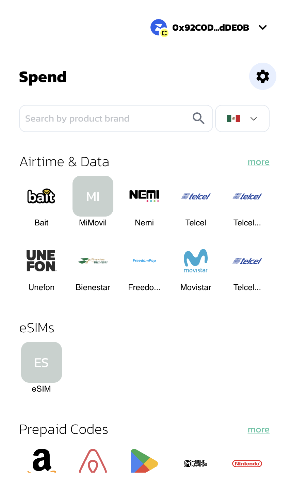
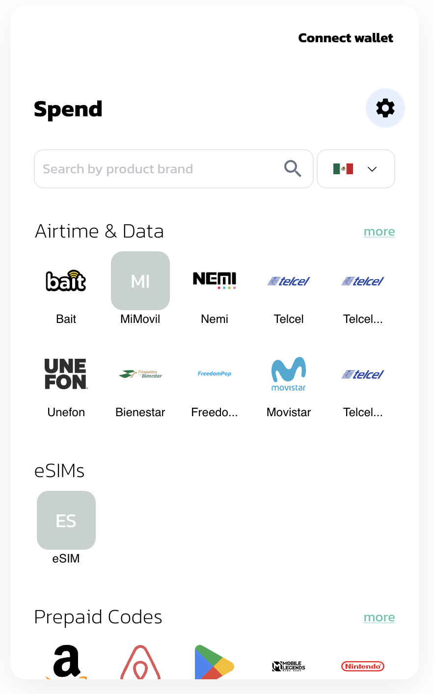
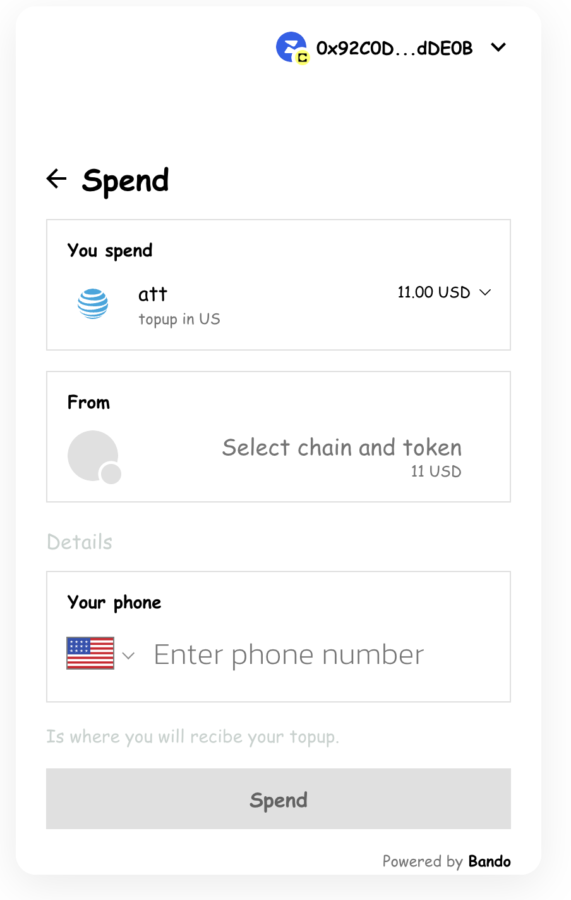
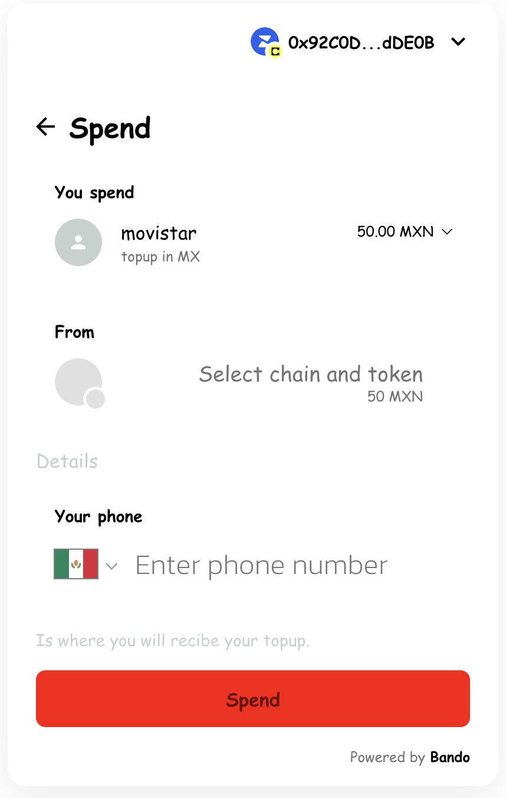

# Customization

Bando's Widget allows for extensive style adjustments, enabling you to align its look with your web app's design. While the overall layout remains fixed, you have control over aspects like colors, fonts, border radius, container styling, and the ability to disable or hide specific UI elements.

**Let's see our first customizations**

```javascript
interface WidgetConfig {
  // sets default appearance - light, dark, or auto
  appearance?: Appearance;
  // disables parts of the UI
  disabledUI?: DisabledUIType[];
  // hides parts of the UI
  hiddenUI?: HiddenUIType[];
  // makes parts of the UI required
  requiredUI?: RequiredUIType[];
  // tweaks container, components, colors, fonts, border-radius
  theme?: WidgetTheme;
}
```

## Theme

Customizing the theme lets you align the Bando Widget with the overall design of your application, ensuring a smooth and cohesive user experience. This option allows you to modify different visual elements of the widget, such as colors, fonts, shapes, and component styles.

To achieve this, we have the `theme` configuration

### Container

The container option focuses on customizing the main widget container. In the following example, the border and border-radius properties of the container are modified.

```javascript
import { BandoWidget, WidgetConfig } from "@bandohq/widget";
import { useMemo } from "react";

export const WidgetPage = () => {
  const widgetConfig: WidgetConfig = useMemo(
    () => ({
      theme: {
        container: {
          boxShadow: "0px 8px 32px rgba(0, 0, 0, 0.08)",
          borderRadius: "16px",
        },
      },
    }),
    []
  );

  return (
    <BandoWidget integrator="Your dApp/company name" config={widgetConfig} />
  );
};
```

<div style="display: flex; justify-content: center;">
  <div style="display: flex; flex-direction: column; align-items: center;">
    
    Before
  </div>

  <div style="display: flex; flex-direction: column; align-items: center;">
    
    After
  </div>
</div>

### Palette, shape, typography

The palette setting allows you to adjust the widget's colors, including backgrounds, greyscale shades, primary and secondary colors, as well as text colors.

The shape setting lets you modify the corner rounding (border-radius) for all elements in the widget.

Typography gives you control over font-related options, such as selecting custom font families.

In this example, we'll tweak the theme by changing the primary and secondary colors, setting a new font family, and adjusting the border-radius for the inner elements:

```javascript
import { BandoWidget, WidgetConfig } from "@bandohq/widget";
import { useMemo } from "react";

export const WidgetPage = () => {
  const widgetConfig: WidgetConfig = useMemo(
    () => ({
      theme: {
        palette: {
          primary: { main: "#7B3FE4" },
          secondary: { main: "#F5B5FF" },
        },
        shape: {
          borderRadius: 0,
          borderRadiusSecondary: 0,
        },
        typography: {
          fontFamily: "Comic Sans MS",
        },
        container: {
          boxShadow: "0px 8px 32px rgba(0, 0, 0, 0.08)",
          borderRadius: "16px",
        },
      },
    }),
    []
  );

  return (
    <BandoWidget integrator="Your dApp/company name" config={widgetConfig} />
  );
};
```



### Components

The components option lets you customize the appearance of individual elements within the widget.

Here are the current components you can adjust, with more to be added in the future:

- **MuiAppBar** serves as the header or navigation bar at the top.
- **MuiAvatar** displays token or chain icons.
- **MuiButton** is used for various buttons throughout the widget.
- **MuiCard** is used for cards within the widget, offering three customizable variants:
  - **outlined**: has thin borders as the default style.
  - **elevation**: adds a shadow effect.
  - **filled**: features a solid background color (based on the palette.background.paper property).
- **MuiIconButton** handles icon-based buttons.
- **MuiInputCard** is used for input forms.

With the components option, you can customize each element's appearance using MUI’s `styleOverrides` feature, allowing precise styling adjustments.

In this example, the `MuiButton` component has been modified to adjust the background color, text color, rounded border, and hover behavior of the button.

```javascript
import { BandoWidget, WidgetConfig } from "@bandohq/widget";
import { useMemo } from "react";

export const WidgetPage = () => {
  const widgetConfig: WidgetConfig = useMemo(
    () => ({
      palette: {
        primary: {
          main: "#006Eff",
        },
        secondary: {
          main: "#FFC800",
        },
        background: {
          default: "#ffffff",
          paper: "#f8f8fa",
        },
        text: {
          primary: "#00070F",
          secondary: "#6A7481",
        },
        grey: {
          200: "#EEEFF2",
          300: "#D5DAE1",
          700: "#555B62",
          800: "#373F48",
        },
      },
      shape: {
        borderRadius: 12,
        borderRadiusSecondary: 12,
        borderRadiusTertiary: 24,
      },
      container: {
        boxShadow: "0px 8px 32px rgba(0, 0, 0, 0.08)",
        borderRadius: "16px",
      },
      components: {
        MuiCard: {
          defaultProps: { variant: "filled" },
        },
        MuiButton: {
          styleOverrides: {
            root: {
              backgroundColor: "red",
              color: "#ffffff",
              borderRadius: "8px",
              "&:hover": {
                backgroundColor: "#0051CC",
              },
            },
          },
        },
      },
    }),
    []
  );

  return (
    <BandoWidget integrator="Your dApp/company name" config={widgetConfig} />
  );
};
```


